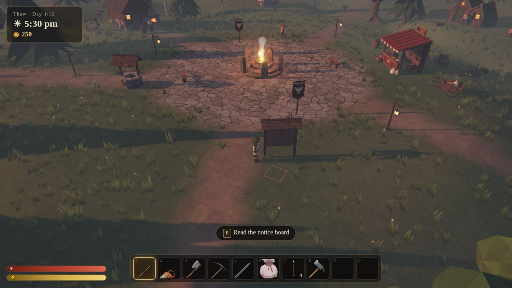
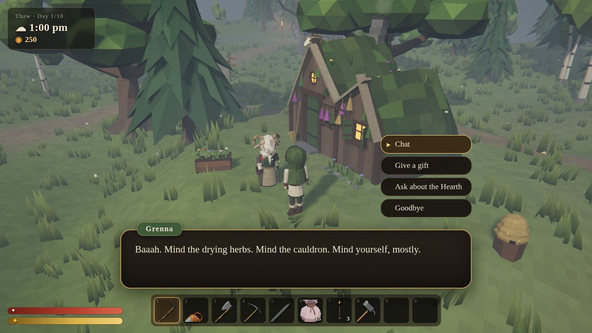
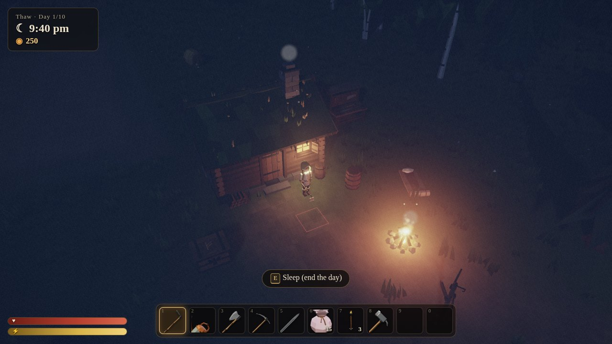
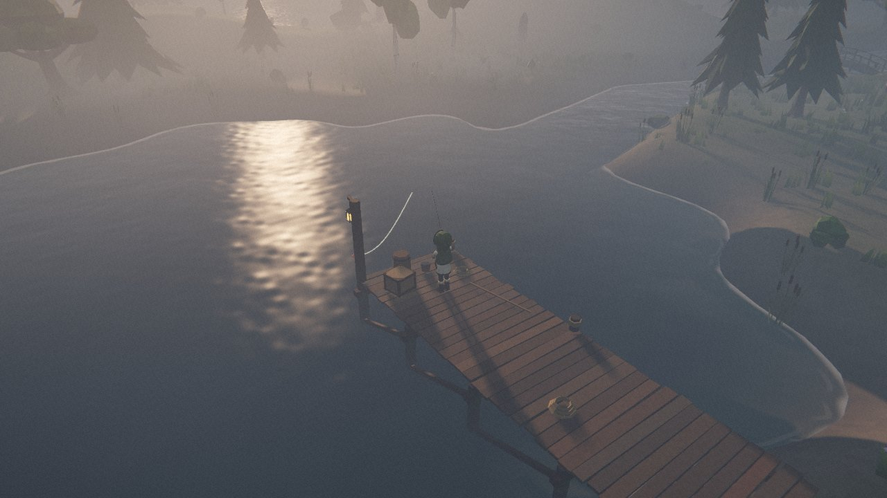
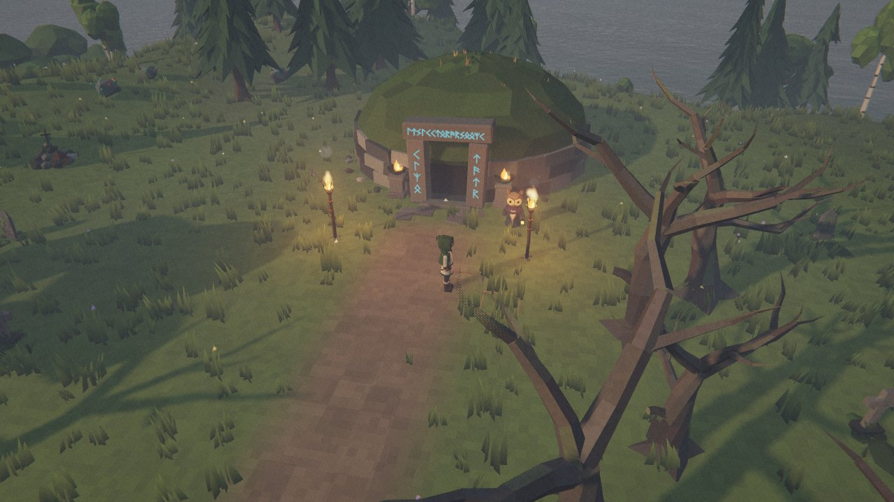

# Gloam

*Tend the soil. Keep the fires lit. Pay the Raven.*

A dark, cozy 3D life-sim for the browser. It combines **Stardew Valley**'s
farming and seasons with **Animal Crossing**'s animal neighbours, debt and
museum, set in **Valheim**'s foggy Nordic world with stamina, firelight and
monsters that come out at night.

You wash up on Gloamhollow, a fog-bound island, inherit your grandmother's croft, and
owe a courteous, slightly sinister raven 3,000 coins. The Great Hearth at
the centre of the village is dying, and as it fades the mist creeps closer
each night. Farm, fish, befriend the villagers, pay back the Raven, and
bring the island six offerings to rekindle the Hearth. Then face what
waits at the altar in the Mistwood.



| | |
|---|---|
|  |  |
|  |  |

## Play

It's a static site with no build step. The browser needs WebGL 2 (any
modern browser has it). It plays best with a keyboard and mouse; on a
phone or tablet you get an on-screen joystick and buttons instead.

```bash
cd gloam
npx serve .                    # or: python3 -m http.server 8080
# then open http://localhost:3000 (or :8080)
```

Opening `index.html` straight from disk won't work, because browsers block
module and model loading over `file://`. You have to serve the folder.

**Quick jumps for testing** (URL parameters):

- `?play&skipintro` skips the title screen and intro.
- `&hour=21` starts at 21:00.
- `&weather=fog` sets the weather.
- `&season=winter` sets the season.
- `&quality=low` / `medium` / `high` picks the graphics quality.

### Controls

| | |
|---|---|
| **W A S D** | move |
| **Shift** | sprint |
| **Space** | dodge-roll |
| **Left-click** | use the held tool or item (aim with the mouse; hold to keep swinging) |
| **E** | talk / pick / harvest / open / sleep at your door |
| **1–0**, **Q / R** | choose a hotbar slot |
| **Right-drag**, **← →** | turn the camera |
| **Wheel** | zoom |
| **Tab** | pack |
| **C** | crafting |
| **J** | journal |
| **M**, or click the minimap | full map (scroll over the minimap to zoom it) |
| **T** | help |
| **Esc** | pause / settings |

On a touchscreen, drag anywhere on the left half to move (drag past the
ring to run), drag on the right half to turn the camera, and pinch to zoom.
The buttons on the right use your tool (hold to keep swinging), interact,
and dodge; the row along the top opens the pack, crafting, journal, map
and menu. The hotbar slots are tappable, and so is the minimap.

## What's in it

**From Stardew Valley**
- A tillable field and nine seasonal crops: till, plant, water, and they grow overnight.
- Crops that don't fit the season wither.
- Crows go after your crops unless you put up a scarecrow; rain totems water crops for you.
- A tithe crate that sells goods overnight.
- A 06:00–02:00 day that ends with a summary screen, four 10-day seasons, and daily weather.
- Tool upgrades at the smith (copper, then iron).
- Offerings to the Hearth that work like the Community Center bundles.

**From Animal Crossing**
- Six animal villagers, each with their own voice (synthesised "animalese"), personality, schedule, gift tastes, requests and 10 hearts of friendship.
- Dialogue: 740+ pages of it.
- A 3,000-coin debt to Corvin the raven, and a longhouse upgrade once it's paid.
- Morrow the owl's Barrow museum, which collects fish, bugs and relics. He hates bugs.
- Bug-catching with a net, fishing, digging up relics, and foraging.

**From Valheim**
- Nordic art direction: volumetric height fog, drifting ground mist, torches that glow in the fog, and bloom.
- A dynamic sky with sun, moon, stars, clouds and a winter aurora, plus the silhouette of a world-tree on the horizon.
- Stamina that refills when you stop, dodge-rolling, and **Rested** / **Well Fed** buffs.
- Crafting and cooking stations, and building with a hammer.
- **The Gloam** at night: gloamlings, wraiths and draugr. Firelight is sanctuary.
- A minimap that turns with your view. It marks villagers, home and the Gloam, and after dark it shows how far each fire's light reaches. Esc → Settings can switch it to north-up or hide it.
- A boss, **Ashhorn the Mist-Stag**.

**Everything is made from scratch.** Around 190 low-poly models are
generated by Python scripts in Blender. Music, ambience, sound effects and
voices are synthesised live with the Web Audio API, so the game ships no
audio files. Icons are rendered from the 3D models at load time.

## Project layout

```
gloam/
├─ index.html, styles.css
├─ src/
│  ├─ main.js              boot: load → title → game loop
│  ├─ engine/              three.js layer
│  │                         terrain, water, sky, atmosphere, post-processing,
│  │                         lighting, grass, particles, instancing, materials, audio
│  ├─ game/                gameplay
│  │                         world, player, farm, resources, NPCs, enemies,
│  │                         fishing, bugs, critters, clock, save state
│  ├─ ui/                  HUD, dialogue, panels, fishing minigame, title, touch controls
│  └─ data/                items, recipes, shop, offerings, dialogue, lore
├─ assets/models/*.glb     exported by the Blender scripts
├─ blender/                procedural modelling scripts (+ ASSETS.md spec)
├─ tools/                  static server, model previewer, screenshot, playtest & publish scripts
└─ vendor/three/           three.js r180 (MIT)
```

## Rebuilding the models in Blender

Every model is generated by code. See `blender/ASSETS.md` for the art
direction and the conventions the game relies on: pivots, socket names,
colliders, material slots.

```bash
pip install bpy                        # Blender as a Python module (Python 3.11)
python blender/build_all.py            # rebuild every .glb
python blender/build_all.py props      # or one category
# with a normal Blender install instead:
blender -b -P blender/build_all.py
```

Preview a model sheet with the game's own materials (needs Node and
Playwright):

```bash
node tools/preview.mjs out.png assets/models/characters.glb --yaw 0
```

## Tests

`tools/playtest.mjs` drives the real game in headless Chromium, using
keyboard and mouse input plus a simulation hook. It covers farming, night
combat, meeting villagers, fishing, bug-catching, offerings, the shop,
crafting, building, the museum, the boss and the ending.

```bash
node tools/playtest.mjs /tmp/pt systems
```

## Publishing as a single page

`tools/build-artifact.mjs` builds a body-only page with `styles.css`
inlined, plus a map of every runtime file to publish next to it. Hosts that
don't serve `.glb` get the models as base64 text, which the model loader
decodes itself.

```bash
node tools/build-artifact.mjs /tmp/out/gloam.html --files /tmp/out/files.json
```

## Credits

- Everything under `src/`, `blender/` and `assets/` was written for this project.
- [three.js](https://threejs.org) r180 (MIT) is vendored in `vendor/three`.
- The fonts are Cinzel and Alegreya from Google Fonts (SIL Open Font License), loaded from their CDN. The game falls back to serif fonts offline.
